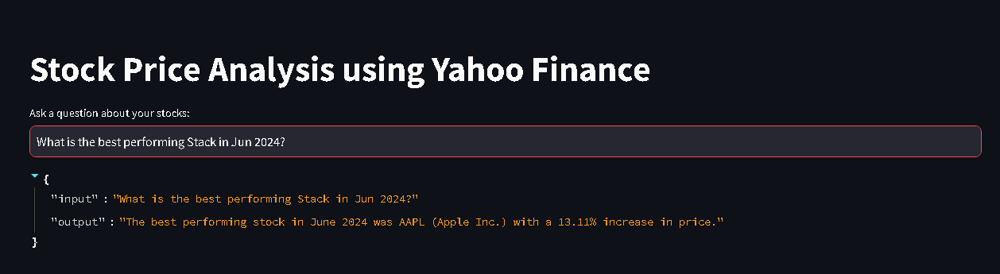

### Create virtual environment
```bash
# create the environment
> python -m venv ./venv
# activate the environment
> .\venv\scripts\activate
```

### Install the required packages
```bash
> pip install -r requirements.txt
```

### Update the .env file
- Rename the .env.example file to .env.
- Populate the value for the keys in the .env file

### Run the application
```bash
    # With Streamlit input and hard-coded questions in the code
    > python main.py
    # with Streamlit to input dynamic question and get output
    > Streamlit run main.py
    # Browse the application with the Url (http://localhost:8501)
```

## Responses
### Question 1:


### Question 2:


### Question 3:


## Output using Streamlit user input

