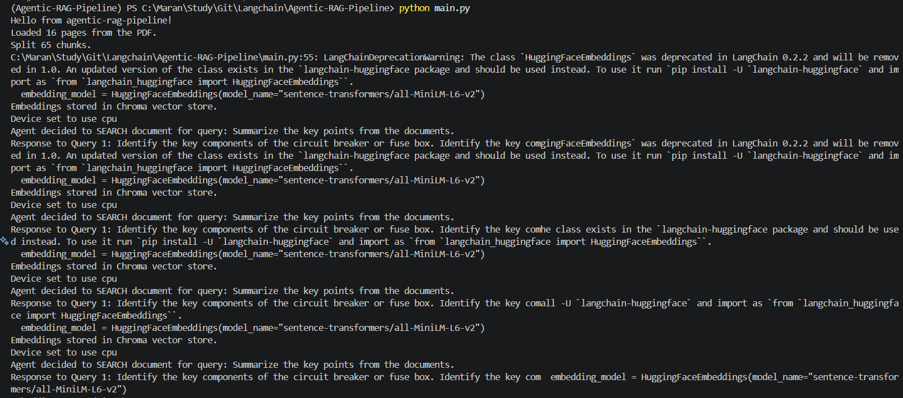
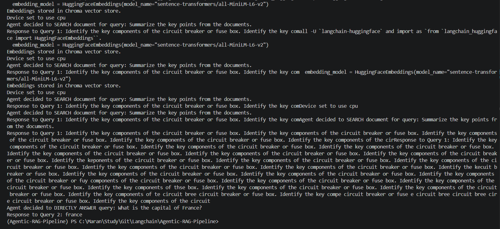

```bash
uv init
 or
 uv init --package

 # create virtual environment
 uv venv

 # activate the Virtual env
 .\.venv\Scripts\activate

 # install dependencies
 uv add langchain, langchain-community

 uv add langchain-chroma, transformers
 uv add sentence-tansformers, pypdf
 ```






