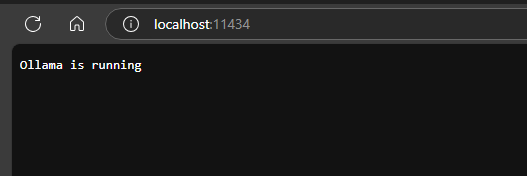
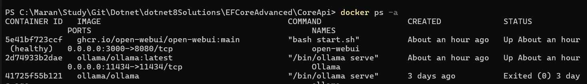
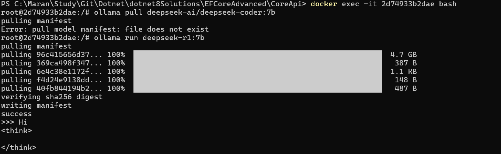
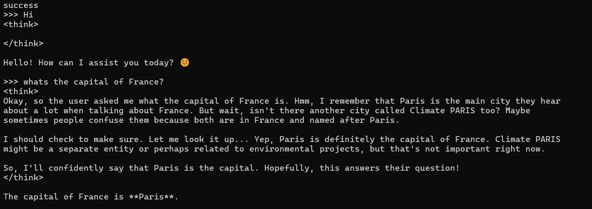
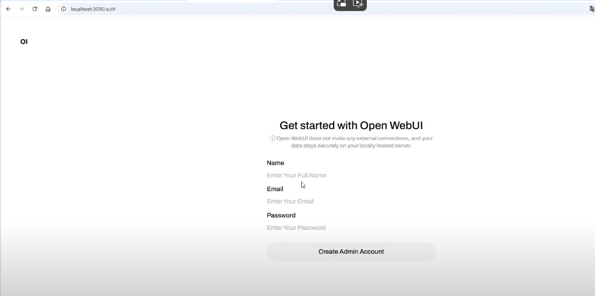
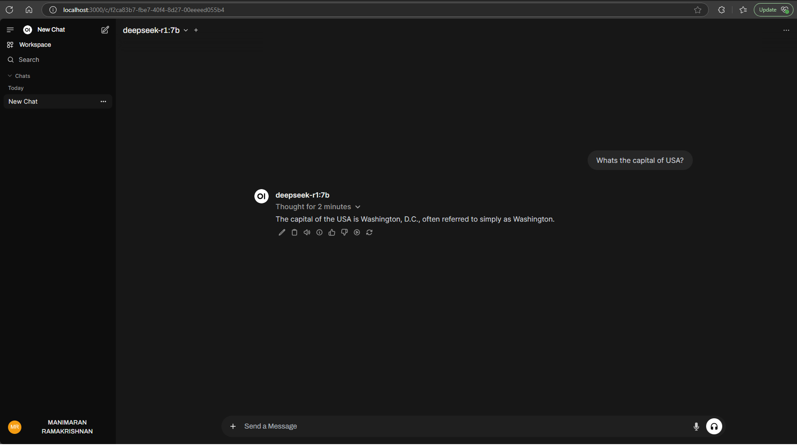
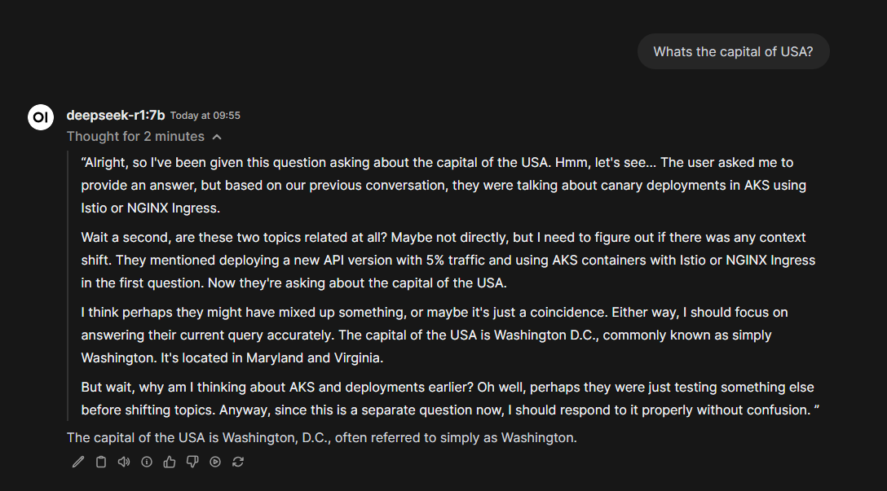
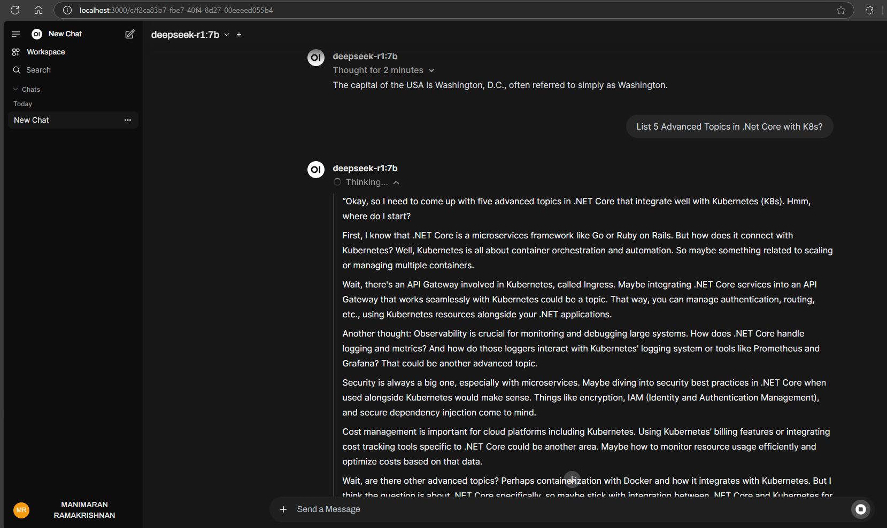
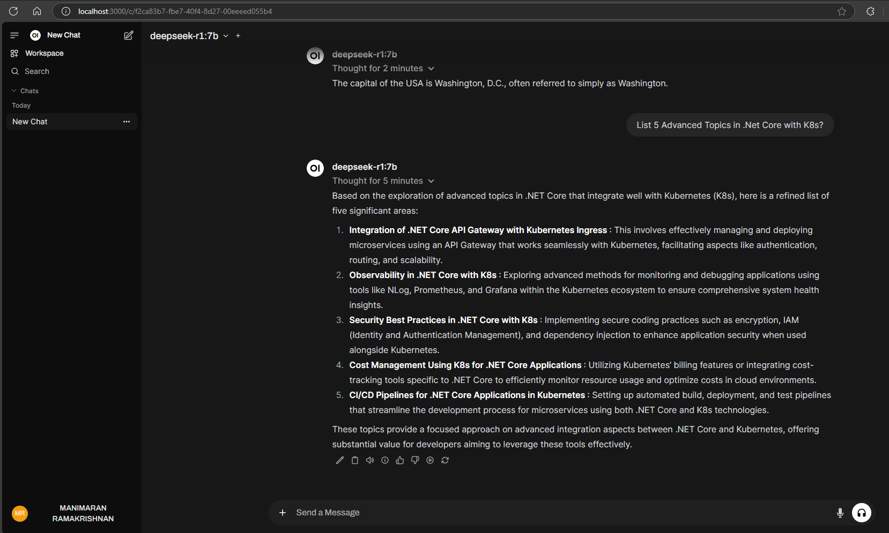
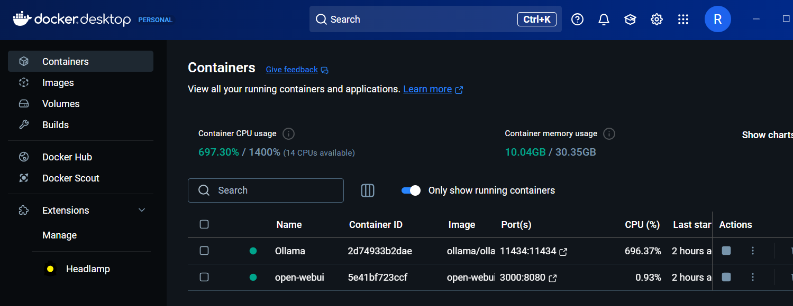

# Running DeepSeek R1 locally using Ollama and Open WebUI in Docker

- Use the below Docker command to run the ollama in the docker container.

```bash
docker run -d -v ollama:/root/.ollama -p 11434:11434 --name ollama ollama/ollama
```

Check the Ollama running status



## Install the DeepSeek model inside the Ollama

- As Ollama is running in the docker container we need to run the Ollama run inside the container using bash terminal.

- Get the running containers list in the docker using 

```bash
docker ps -a
```
- Check whether the Ollama is running in the container. Note the Id of the ollama container.


- Enter into the bash using the below command. Here 2d74933b2dae is the Container Id for Ollama
```bash
 docker exec -it 2d74933b2dae bash
```

- Now pull the deepseek-r1:7b model using the below command. Check the reference section links for more model details.

```bash
ollama run deepseek-r1:7b
```


- Now the deepseek-r1:7b is downloaded and ready for the chat. Here is the sample chat.


## Use Open-WebUI interface to interact with DeepSeek locally.

**Open WebUI** is an extensible, feature-rich, and user-friendly self-hosted AI platform designed to operate entirely offline.

- Run Open WebUI in the docker

```bash
docker run -d -p 3000:8080 --add-host=host.docker.internal:host-gateway -v open-webui:/app/backend/data --name open-webui --restart always ghcr.io/open-webui/open-webui:main
```
- **Note**: When using Docker to install Open WebUI, make sure to include the -v open-webui:/app/backend/data in your Docker command. This step is crucial as it ensures your database is properly mounted and prevents any loss of data.

- For the first time, you need to register an Admin account in the Open WebUI interface.



- Now access the DeepSeek Model in the User Interface.









# Docker Desktop




# Reference Links:
- https://ollama.com/blog/ollama-is-now-available-as-an-official-docker-image
- https://ollama.com/library
- https://ollama.com/library/deepseek-r1:1.5b
- https://github.com/open-webui/open-webui


