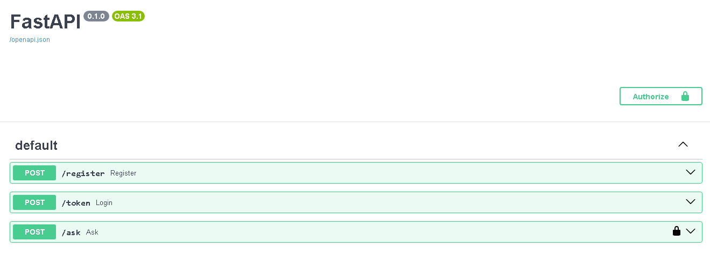
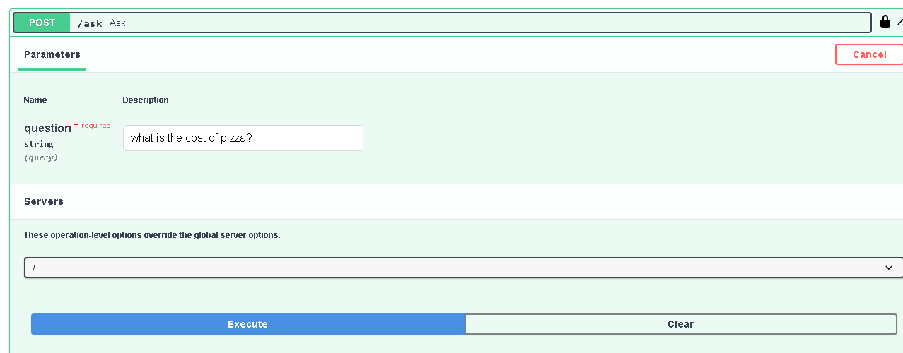
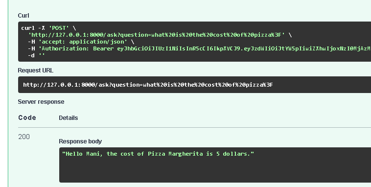
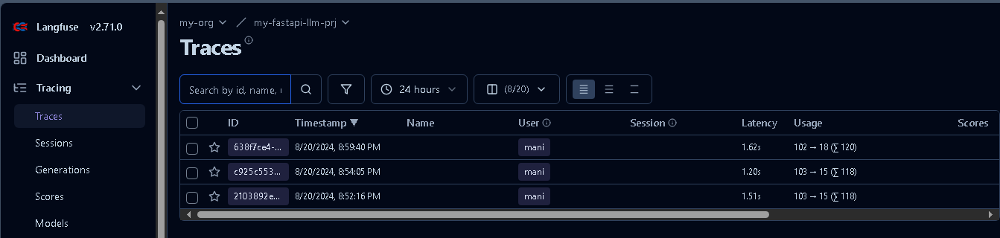
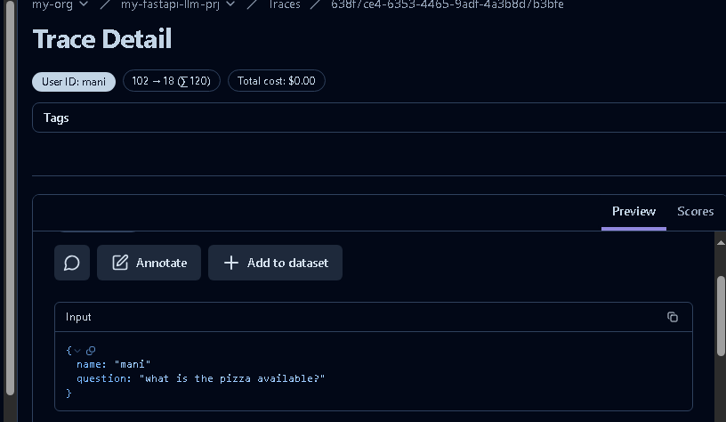
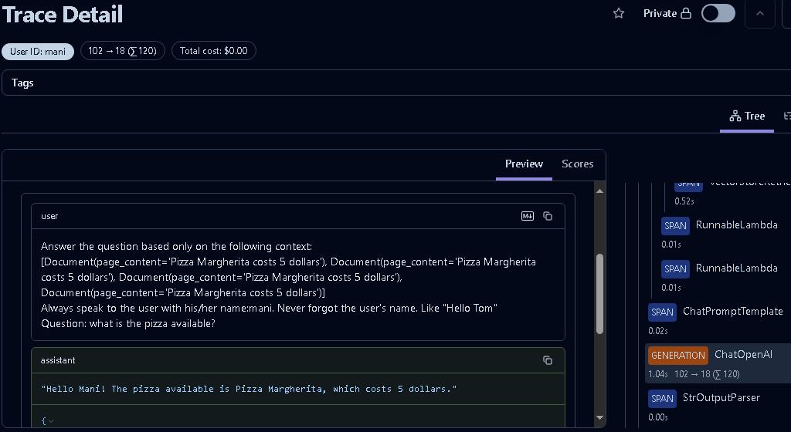

## LangFuse
- Uses FastApi and Uvicorn to create API endpoints
- Data are stored in Postgresql
- The endpoints are
  - Register
  - Token
  - Ask
- For example, added only one document to vector database.
- use Langfuse to trace the operations



## Output




## LangFuse tracing






## Run the App
```bash
streamlit main:app --reload
```
