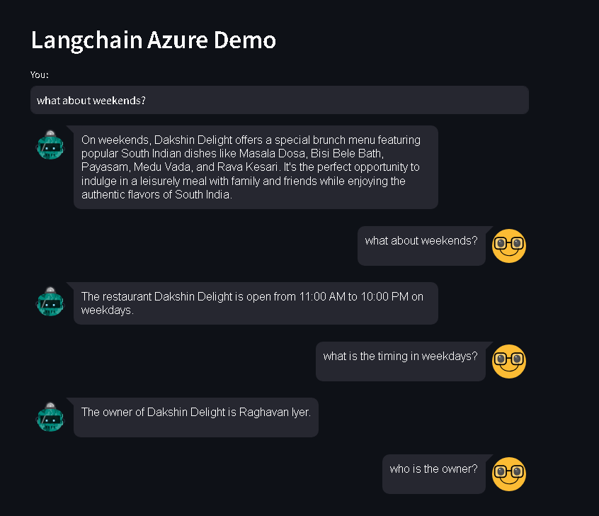

# Perform RAG search using Azure Blob Storage, Azure AI Search and OpenAI
This project will perform
- Upload the files to Azure Blob Storage
- Create chunks and embeddings and Store in Azure AI Search
- Perform Search 

## Upload the files to Azure Blob Storage
- Place the files that needs to be uploaded in the Data folder
- Create the Azure Storage account and a Container
- Copy the details to .env file
- Run the python file using the command
  ```bash
     python blob.py
  ```

## Create Embeddings using OpenAI embeddings and store it in Azure AI Search
- Access the files from the blob storage
- Create chunks and create embeddings
- Store the Embeddings in new Index in Azure AI Search
- Run the python file using the command
  ```bash
     python az_cognitive_search.py
  ```

## Use the Streamlit app to connect to Azure AI Search and Perform Chat
- Copy and Fill the details about the Azure AI Search Key, endpoint and index name to .env file
- Run the Streamlit app using 
  ```bash
     streamlit run app.py
   ```


## output
