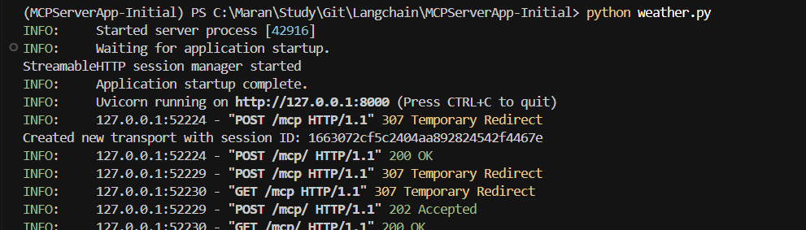

# MCP Server and Client using Python, FastMCP, and Langchain

This project demonstrates how to create and use Model Context Protocol (MCP) servers with Langchain and FastMCP. It includes two MCP servers (Math and Weather) and a client that consumes these services.

## Project Overview

- **Math Server**: Provides basic arithmetic operations (add, subtract, multiply)
- **Weather Server**: Provides weather information for cities
- **Client**: Connects to both servers and uses Groq's LLM to process requests

## Setup Instructions

### Environment Setup

```bash
# Install uv package manager
pip install uv

# Initialize uv in the project
uv init

# Create a virtual environment
uv venv

# Activate the virtual environment
# On Windows:
.\venv\Scripts\activate
# On Unix/Linux/Mac:
# source venv/bin/activate
```

### Install Dependencies

```bash
# Install dependencies from requirements.txt
uv add -r requirements.txt
```

### Environment Variables

Create a `.env` file based on the provided `.env.example`:

```
GROQ_API_KEY="your_groq_api_key_here"
```

## Running the Application

### Start the Weather Server

```bash
python weather.py
```

The Weather server runs on http://localhost:8000/mcp with streamable-http transport.



### Run the Client

```bash
python client.py
```

The client connects to both the Math server (via stdio transport) and Weather server (via HTTP), and uses Groq's LLM to process requests.


## Project Structure

- `main.py`: Simple entry point
- `mathserver.py`: MCP server providing math operations
- `weather.py`: MCP server providing weather information
- `client.py`: Client that connects to both servers
- `requirements.txt`: Project dependencies

## Dependencies

- langchain-groq: Integration with Groq's LLM
- langchain-mcp-adapters: Adapters for MCP protocol
- mcp: Model Context Protocol implementation
- langgraph: For creating agent workflows

## How It Works

1. The Math server provides tools for basic arithmetic operations using stdio transport
2. The Weather server provides a tool to get weather information using HTTP transport
3. The client connects to both servers, retrieves their tools, and uses Groq's LLM to process requests
4. The client demonstrates using both servers by calculating a math expression and getting weather information