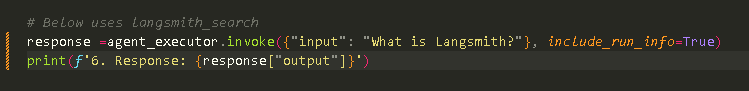
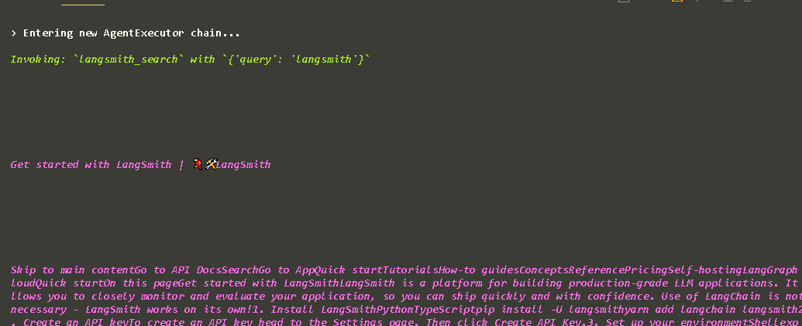
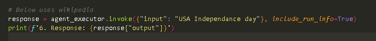
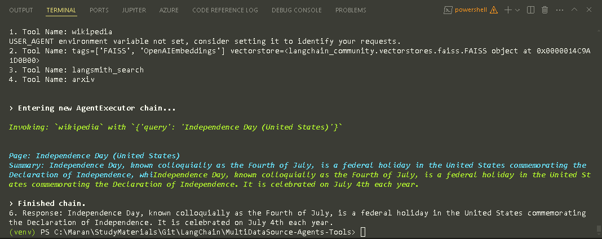
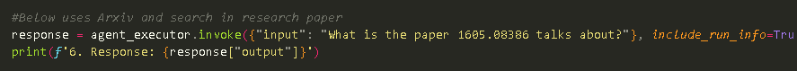
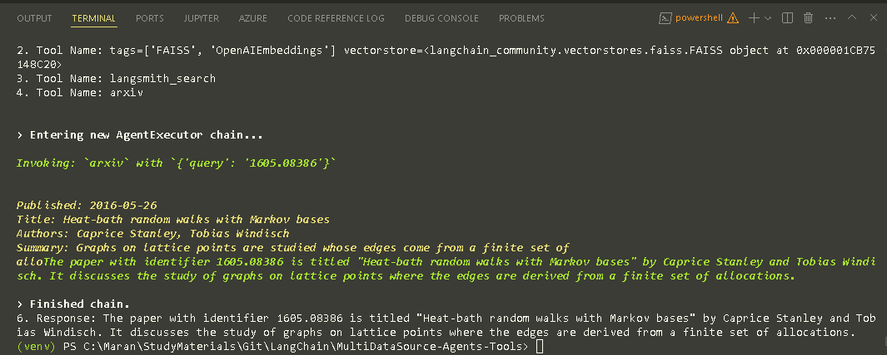
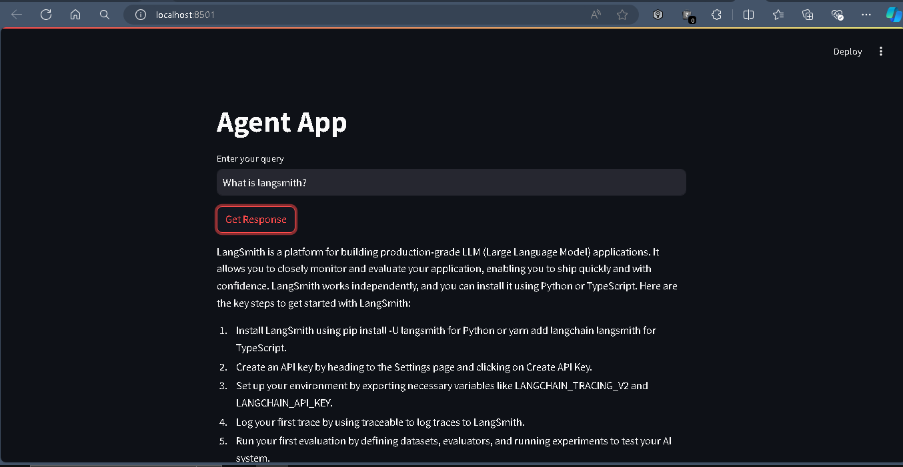

# Using Agents and Tools with multiple Datasources in Langchain

### Agents
Agent is to use a language model to choose a sequence of actions to take. 
- In Chains, a sequence of actions is hardcoded (in code)
- In agents, a language model is used as a reasoning engine to determine which action to take and in which order
   
### Tools
Tools are interfaces that a agent, chain or LLM can use to interact with the world.


## Vector Search in Faiss Db
Query in the code:


Output:


## Wikipedia Search
Query in the code:


Output:


## Arxiv Search output
Query in the code:


Output:


## Adding Streamlit app


## Usage 
1. setup the OpenAI API key in .env file.  use the .env.example file and rename to .env
2. To run without streamlit
   1. Comment the Streamlit portion in the code
   2. Run the below command
   ```bash
        python main.py
    ```
3. To run with Streamlit
   1. Comment the individual agent execution call
   2. Run the below command
   ```bash
        streamlit run main.py
    ````