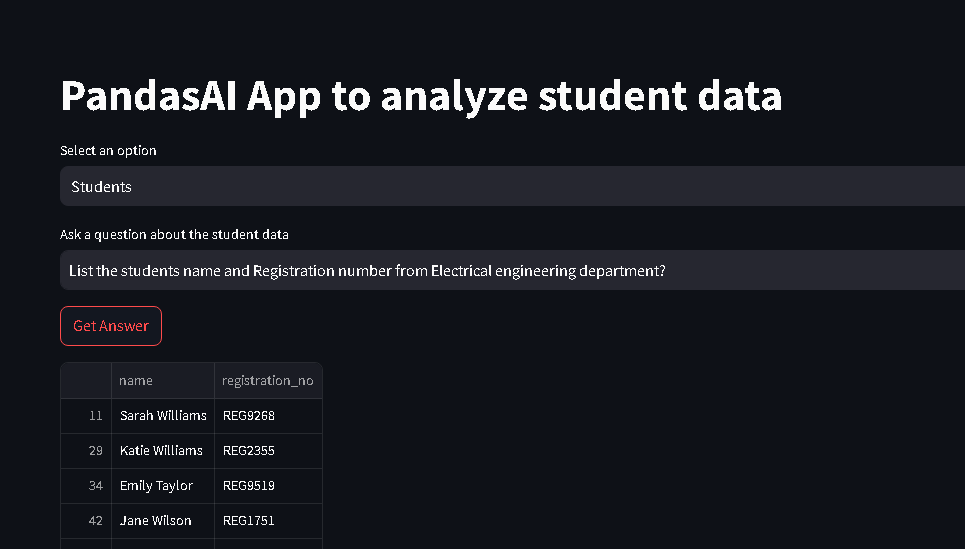
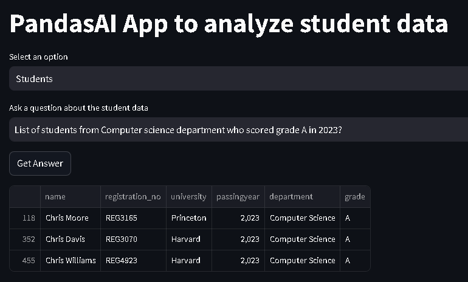
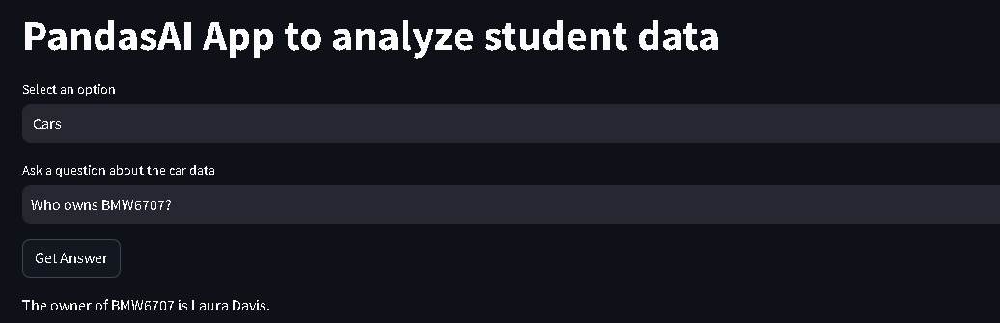
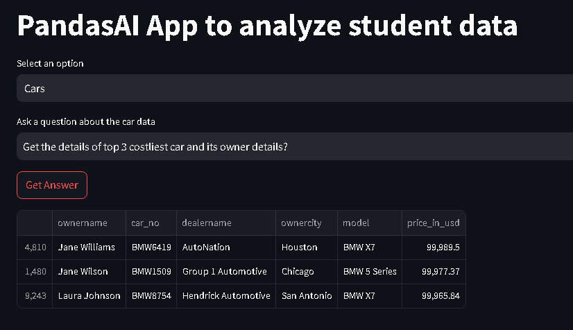

# Using Pandas ai and Langchain_openai LLM to interact with Multiple csv files

## Sample Questions
1. which student has the registration number REG7878
2. Count of students from Electrical engineering department?
3. List the students name and Registration number from Electrical engineering department?
4. List of students from Computer science department who scored grade A in 2023?
5. Who owns BMW6707?
6. Get the details of top 3 costliest car and its owner details? 


## Outputs








## Run the app using 
```bash
streamlit run main.py
```