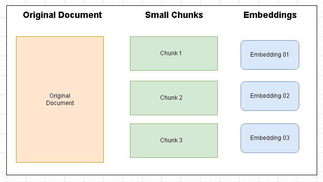
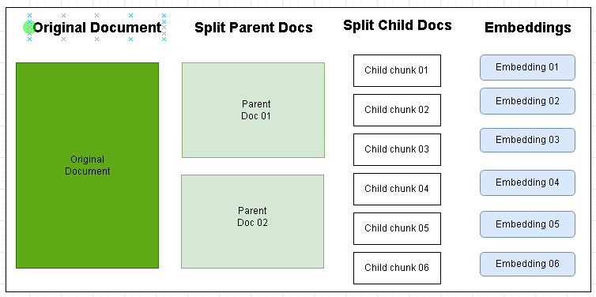
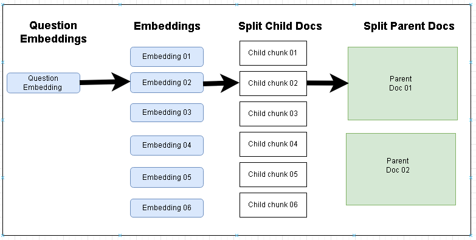

# Parent-Document Retriever
In the Normal Document Split and embedding, the original documents will be splitted to smaller chunks. When Searching, the smaller chunks will be retreived and pass to LLM. In this approach the context may get reduced when passing the smaller chunks.

Instead, the Original Document will be split in to little larger chunks called the Parent Docs/Chunks. Later these Parent Docs/Chunks will be further split in to smaller chunks. Then the embedding will be performed on the smaller chunks.

When Searching with a question, the question will be embedded first. Then the similarity search is performed on the Smaller chunks, which is embedded. The Matching smaller chunks embedding is used to retrieve the Parent larger chunck. This will be passed to LLM. In this way the output will be more closer get the full context. 

Below diagrams describes the normal and parent document retrieval flow.

## Normal Document Splitting and Embedding

## Parent Child Splitting and Embeddings

## Retrieval of Parent Document After matching the Child Docs

## Output:
Refer the Output.txt file. It will contains the information of context retrieved for the question we are passing.
