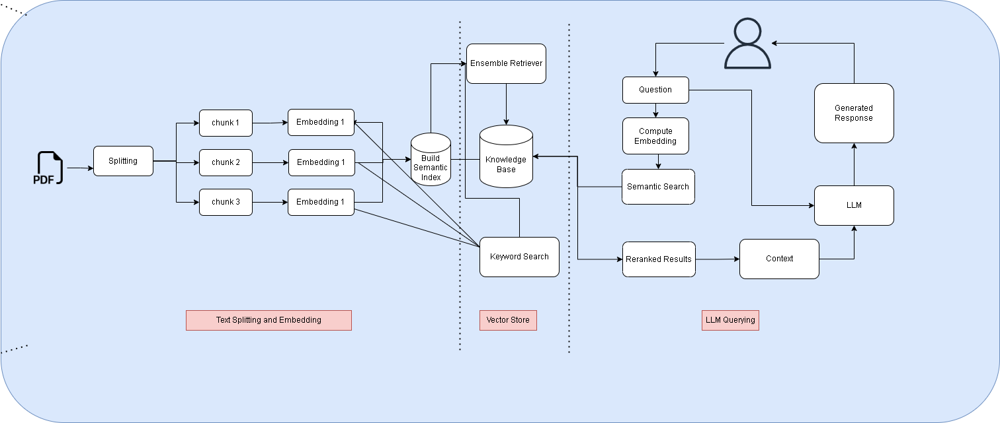

# Perform Hybrid Search using BM25 and Ensemble Retriever

## Architecture

## Retrievers
- Retriever is an interface that returns documents
- Retriever accepts a string query as input and return list of Documents as output

### Types of Retrivers
- Vector store-backed retriever  
- MultiQuery Retriever
- Custom Retriever
- Ensemble Retriever
- MultiVector Retriever
- ParentDocument Retriever
- Self-quering
- Time-weighted vector store retriever

## Ensemble Retriever
- Takes a list of retrievers as input and ensemble the results of their get_relevant_documents() methods and rerank the results based on the Reciprocal Rank Fusion algorithm
- Combine BM25 with Embedding Similarity to get the output