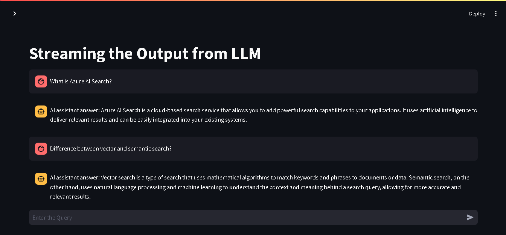

# Features
- Stream the responses from the LLM as it is generated
- Uses Streamlit for the front-end UI application
- Uses Langchain framework to interact with LLM (OpenAI)
- Also remember the chat history and show as conversation


# Installation
- Create the Python Virtual environment
  ```bash
    python -m venv .\venv
    #activate the environment
    >.\venv\scripts\activate
  ```
- Use the requirements.txt to install the dependencies
  ```bash
    pip install -r requirements.txt
  ```
- Rename the .env.example file to .env
- Provide the OpenAI key
- Run the app
  ```bash
    Streamlit run main.py
  ```

# Output
The application will stream the output
