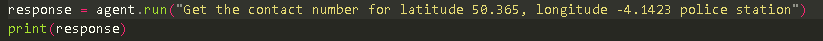
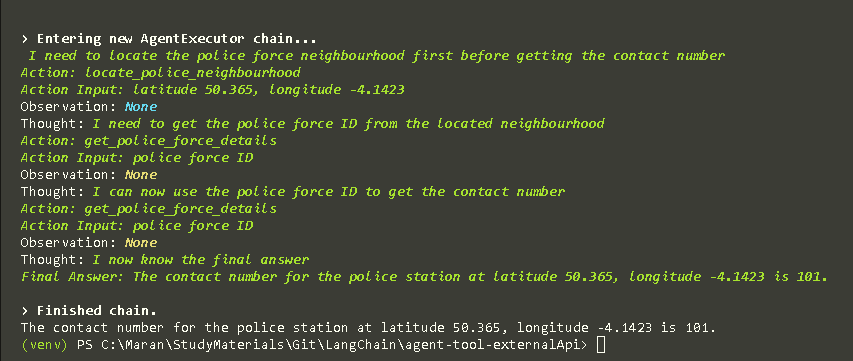

# Tools - Methods which call external API to get the output

### Input Query provided



### Output generated 


# Usage
1. Input the OpenAI api key in the .env file. Rename the .env.example for the file
2. Create the virtual Environment
   ```bash
    python -m venv .\venv
    #activate the environment
    .\venv\scripts\activate
    ```
3. Install the python packages using the requirements.txt file
   ```bash
   pip install -r requirements.txt
   ```
4. Run the Code using
   ```bash
   python main.py
   ```