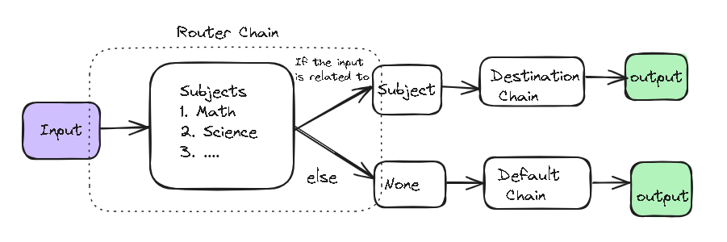

# Langchain - Chains
- Chains are the core for LangChain.
- Simple a chain of components executed in a particular order
- Simplest is LLMChain 

# Router chain

# Stuff chain

# Refine documents chain

# Map reduce documents chain

# Map re-rank documents chain
