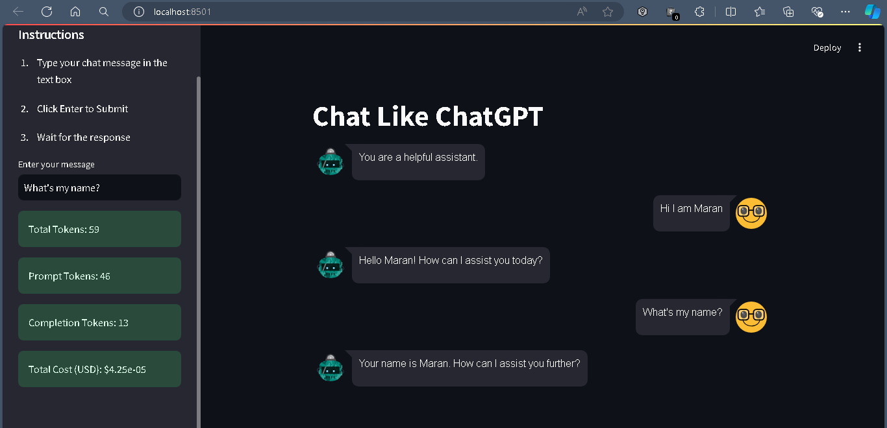

## Chat like ChatGPT
> Uses Streamlit for the UI
> Uses Streamlit session state to store the previous conversation
> Will Print the Tokens, Cost used on each response

# App UI

# Instructions
> Create a .env file or use the .env.example file
> Input your OpenAI_API_KEY
> Create the Venv
> use the Requirements.txt to install the python packages
> pip install -r requirements.txt
> Run the Streamlit application using
> streamlit run main.py