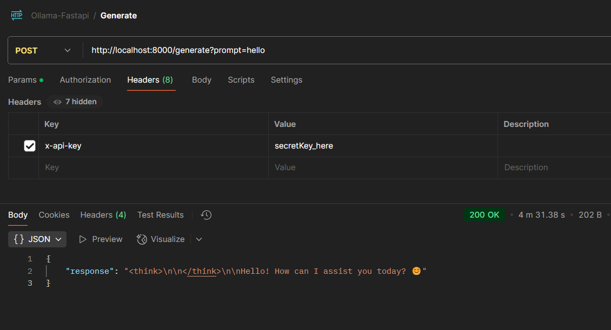
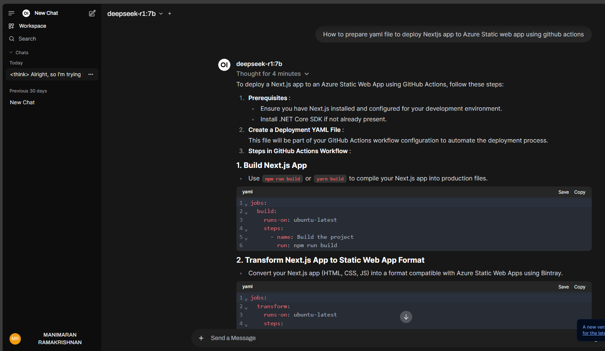
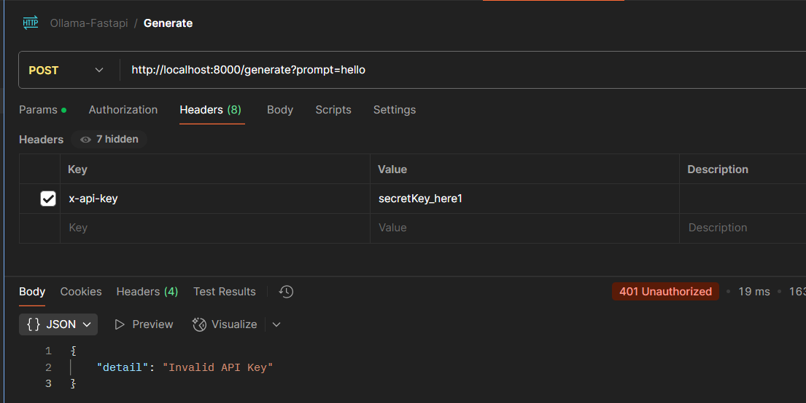

# FastApi with Ollama - Deepseek-r1

## Ollama in Docker

- Download and run the `ollama` in the docker container

```bash
docker run -d -v ollama:/root/.ollama -p 11434:11434 --name ollama ollama/ollama
```

- If the image and container is already available in the machine, you can run the existing container using:

```bash
# Start the existing container
docker start ollama
```
- If you want to remove the existing container and create a new one:

```bash
# Remove the existing container
docker rm ollama

# Then run your original command
docker run -d -v ollama:/root/.ollama -p 11434:11434 --name ollama ollama/ollama
```

- If you want to create a new container with a different name:
```bash
# Run with a different name (e.g., ollama2)
docker run -d -v ollama:/root/.ollama -p 11434:11434 --name ollama2 ollama/ollama
```

- Check the status of the containers using
```bash
# List all containers (including stopped ones)
docker ps -a
```
## Download and run deepseek-r1:7b

```bash
ollama run deepseek-r1:7b
```

## Run the App
```bash
# start the fast api app
uvicorn main:app --reload
```

## Test the Generate endpoint
Note: Depends on your machine hardware, it will take time to get the response from the model.



## Testing the Ollama model using UI:

- Used Open-WebUI interface.

- Run Open WebUI in docker using 

```bash
docker run -d -p 3000:8080 --add-host=host.docker.internal:host-gateway -v open-webui:/app/backend/data --name open-webui --restart always ghcr.io/open-webui/open-webui:main
```



## Providing Invalid API key:


## Shut down the containers

1. Using docker stop (graceful shutdown)
```bash
# Stop container using container name
docker stop ollama

# Or stop container using container ID
docker stop <container-id>
```

2. Using docker kill (immedialty shutdown)
```bash
# Force stop the container
docker kill ollama
```
3. To stop multiple containers at once
```bash
# Stop multiple containers by listing their names/IDs
docker stop container1 container2 container3
```
4. To stop all running containers
```bash
docker stop $(docker ps -q)
```

## Some useful commands
```bash
# List running containers
docker ps

# List all containers (including stopped ones)
docker ps -a

# Remove a stopped container
docker rm ollama

# Remove a container forcefully (even if running)
docker rm -f ollama
```