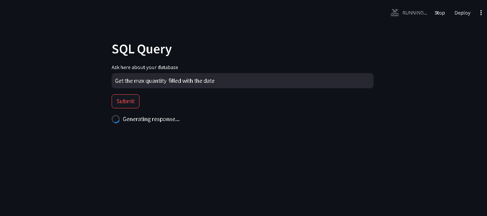
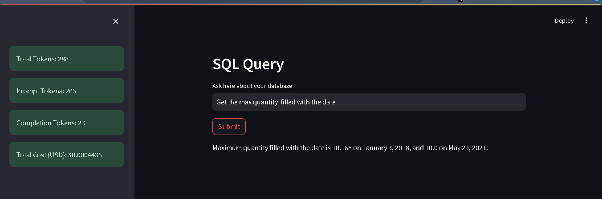
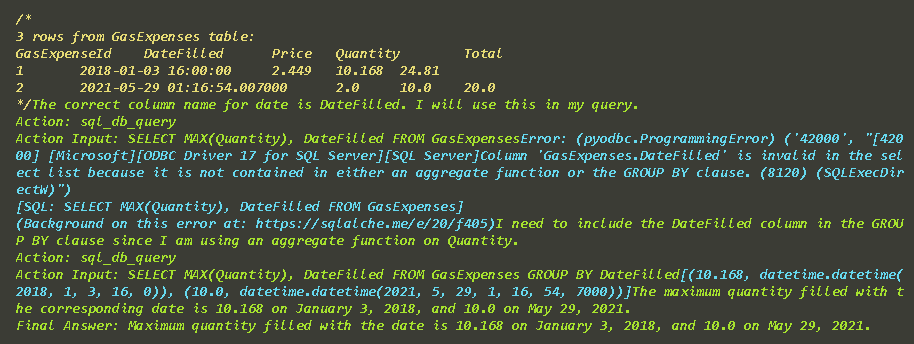

# Query MS SQL Server table data using OpenAI LLM
---------------------------------------------------

Uses the MS SQL Server table which contains 1 table GasExpenses
To connect to Database I am using ODBC and Sqlalchemy engine

contins the below columns
- Id
- DateFilled
- Price
- Quantity
- Total
### Below is the UI to perform the Query

### Below is the output from the table using the Agent

### Background agent processing
