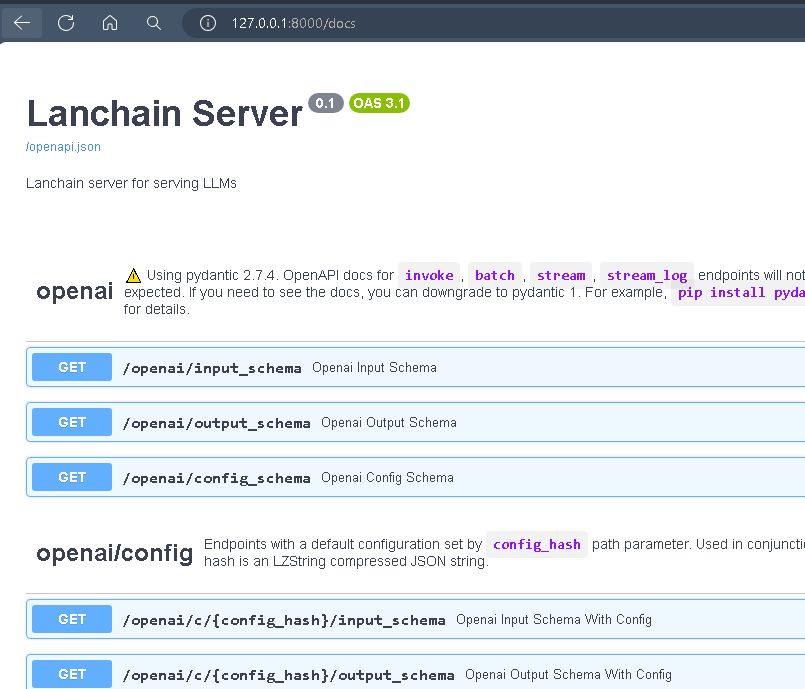
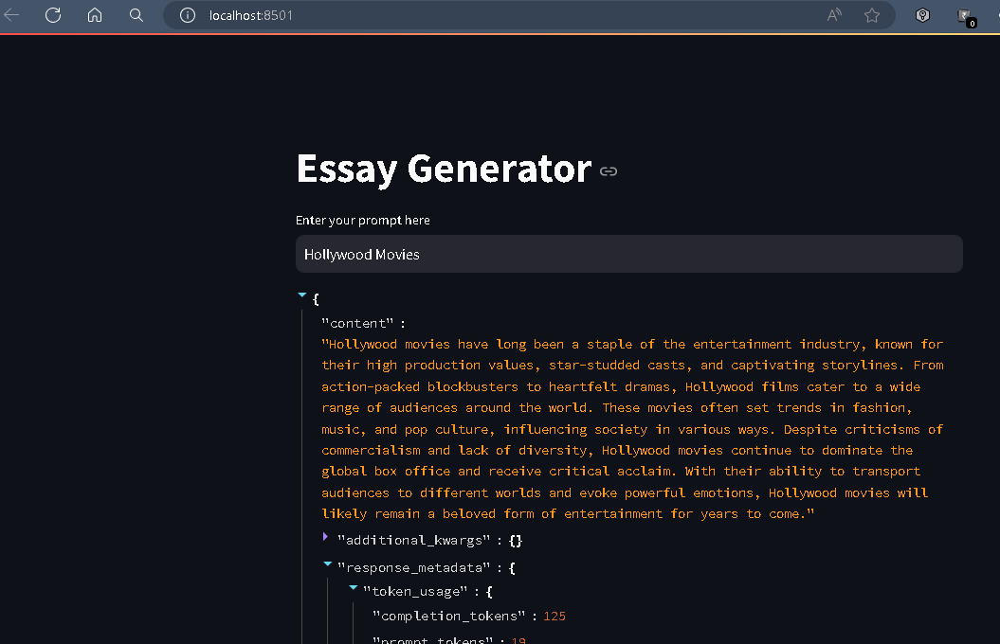

FAST API endpoints are exposed to interact with OpenAI

run the FastAPI using uvicorn app:app --reload

Access the endpoints details using Swagger under [http://](http://127.0.0.1:8000/docs)

Endpoint for writting essay http://127.0.0.1:8000/essay/invoke

#####
Client Web App
Use Streamlit to create the app in the client.py file
call the above essay endpoint and print the response

To run the streamlit app.
  > Open another Terminal
  > Activate the virtual environment
  > use the command streamlit run client.py

  The Streamlit app will be running in the Url: http://localhost:8501

  